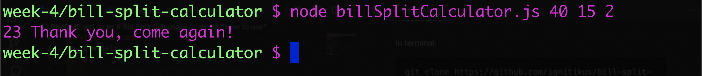

# Bill Split Calculator
Small Node app that takes the total for a breakfast/lunch/dinner, calculates and adds tips and also can split between any number of people. 

## *Installation*
In terminal:
    
    git clone https://github.com/ignitikus/bill-split-calculator
    cd bill-split-calculator
and it's ready to use.

## *How to use*
***Make sure you have node.js installed before using this app***  
In terminal: 

    node bill-split-calculator yourTotal percentageOfTips howManyPeople

For example:
